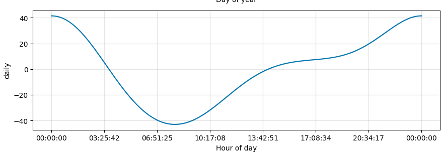
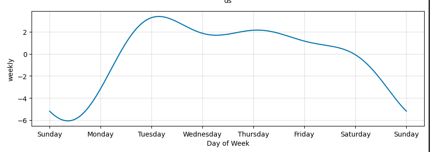
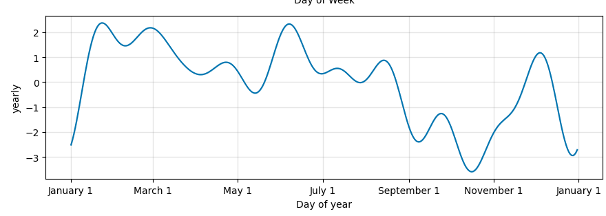
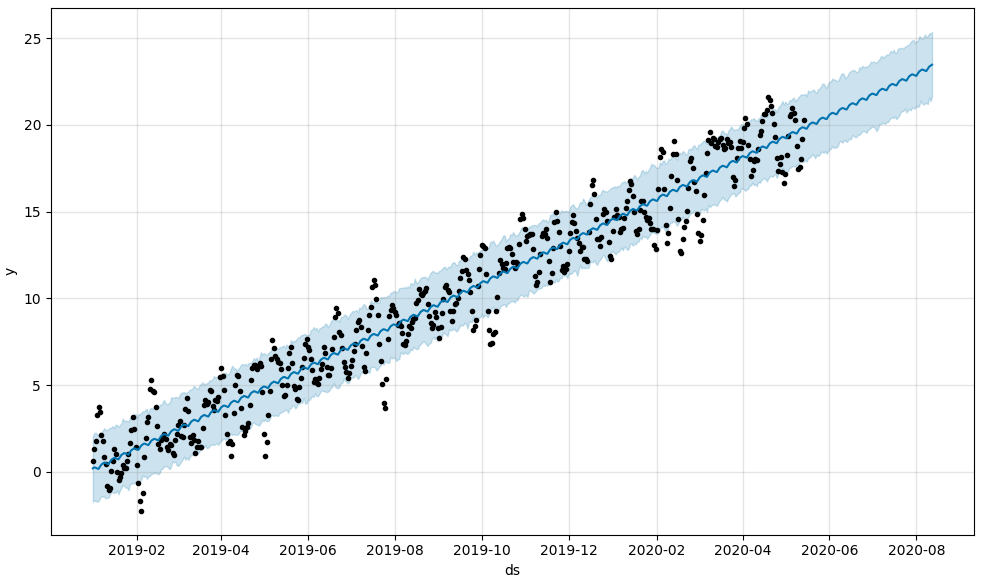

The applicaiton helps forecast future stock prices and revenue based on historic search results, stock price and daily revenue of  MercadoLibre. With over 200 million users, MercadoLibre is the most popular e-commerce site in Latin America. 

The application accesses the current search traffic, stock price and revenue data and forcasts the following. 

- Visual depictions of seasonality (as measured by Google Search traffic) that are of interest to the company.

- An evaluation of how the company’s stock price correlates to its Google Search traffic.

- A Prophet forecast model that  predict hourly user search traffic.
  
- A forecast for the company’s future revenue.

## Output

- The application outputs simulation projected returns and search trends 

#### Search Traffic by Hour

#### Search Traffic by Day

#### Search Traffic by Month

#### 90 Day Sales Forecast

---

## Technologies

The program was written in Python using Google Colab platform which enabled us to use Fb Prophet for our cause.

The required installations include:

- Pystan
- Fb Prophet
- holoviews
- hvplot
For more information on FB Prophet

---

## Installation Guide

The user of the application will have to download Python,   Python package manager PIP and Git.

   - [How to install Python](https://www.python.org/downloads/) 
   - [How to install PIP ](https://pip.pypa.io/en/stable/installation/) 
   - [How to install Git ](https://git-scm.com/book/en/v2/Getting-Started-Installing-Git)
   - [How to install Prophet ](https://facebook.github.io/prophet/docs/installation.html#installation-in-python)

---

## Contributors

This application is Mario G.

---
